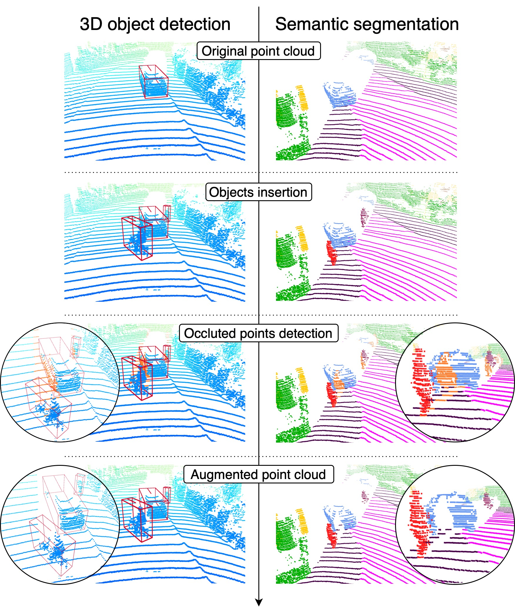
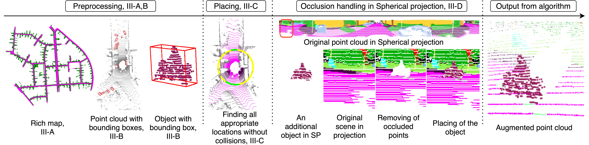

# Real3D-Aug




`Real3D-Aug` is a open source project for 3D object detection and semantic segmentation.  

Official paper is published on [arxiv](https://arxiv.org/abs/2206.07634).

`Real3D-Aug` was proposed as lidar augmentation framework, which reuses real data and automatically finds suitable
placements in the scene to be augmented, and handles occlusions explicitly. Due to the usage of the real data,
the scan points of newly inserted objects in augmentation sustain the physical characteristics of the lidar,
such as intensity and raydrop.


### Overview of the repo

- [Introduction](#Introduction)
- [Content](#Content)
- [Demo](#Demo)
- [Licence](#Licence)
- [Acknowledgement](#Acknowledgement)
- [Contribution](#Contribution)

<br clear="right"/>

## Introduction

Object detection and semantic segmentation with
the 3D lidar point cloud data require expensive annotation. We
propose a data augmentation method that takes advantage of
already annotated data multiple times. We propose an augmenta-
tion framework `Real3D-Aug`. 


### Proposed pipeline 

The pipeline proves competitive in training top-performing models
for 3D object detection and semantic segmentation. The new
augmentation provides a significant performance gain in rare
and essential classes, notably 6.65% average precision gain for
“Hard” pedestrian class in KITTI object detection or 2.14 mean
IoU gain in the SemanticKITTI segmentation challenge over the
state of the art.


As it is shown on image below, the process of augmentation is divided into 4 steps.

1. **Preprocessing** - In the first step we need to create Rich map if it is not provided. For semantic segmentation dataset we also provide method how to create bounding boxes, which are necessary in further stages.
2. **Placing** In this stage the possible placements are found.
3. **Occlusion handling in spherical coordinates** - To ensure the reality of scanning the occlusion is handled. 
4. **Output** - Augmented scene is created and saved.




## Content

Project is divided into two parts, semantic segmentation and 3D object detection. Each section contains README.md, where is clearly described how to use the framework.


```
3D-object-detection
  README.md
  config/
  cut_object/
  Real3DAug/
  rich_map/
  pseudo_labels/
  
semantic-segmentation/
  README.md
  config/
  cut_object/
  Real3DAug/
  rich_map/
  bounding_boxes/
  
```
## Getting Started

Continue to [semantic segmentation](semantic_segmentation/README.md) or [3D object detection](3D-object-detection/README.md) part of the project depending on the task you are working on.


## Licence

`Real3D-Aug` is released under the [licence](LICENCE.md)

## Citation

```
@misc{https://doi.org/10.48550/arxiv.2206.07634,
  doi = {10.48550/ARXIV.2206.07634},
  url = {https://arxiv.org/abs/2206.07634},
  author = {Šebek, Petr and Pokorný, Šimon and Vacek, Patrik and Svoboda, Tomáš},
  keywords = {Computer Vision and Pattern Recognition (cs.CV), Artificial Intelligence (cs.AI), FOS: Computer and information sciences, FOS: Computer and information sciences},
  title = {Real3D-Aug: Point Cloud Augmentation by Placing Real Objects with Occlusion Handling for 3D Detection and Segmentation},
  publisher = {arXiv},
  year = {2022},
  copyright = {Creative Commons Attribution 4.0 International}
}
```

## Acknowledgement
This work was supported in part by OP VVV MEYS
funded project CZ.02.1.01/0.0/0.0/16 019/0000765 “Research
Center for Informatics”, and by Grant Agency of the CTU
Prague under Project SGS22/111/OHK3/2T/13. Authors want
to thank colleagues from Valeo R&D for discussions and Valeo
company for a support.

## Contribution

Feel free to contact us for any potential contributions.
